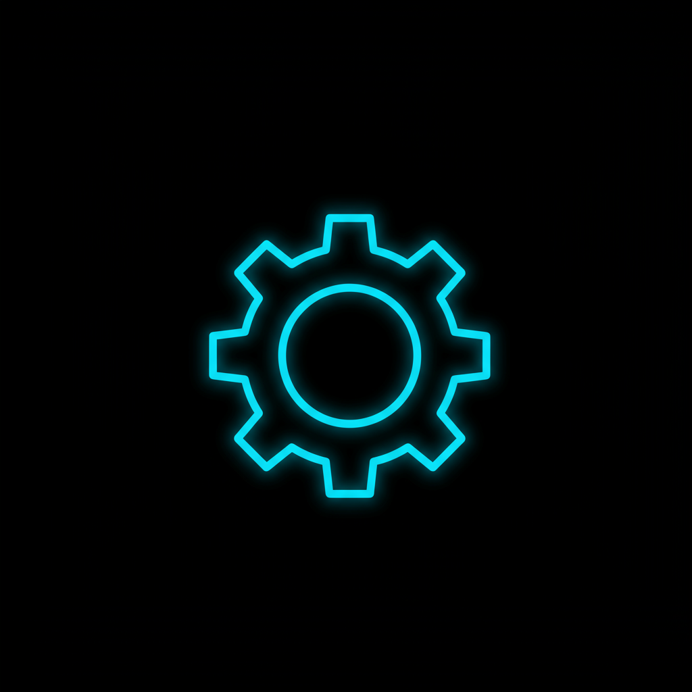

<div align="center">

# DockGlo

**Beautify your macOS Dock — rainbow by icon color, or smart by how you actually use apps.**



</div>

## What it does

DockGlo reorders your Dock safely (full backup first, one-command undo):

| Mode | Result |
|------|--------|
| **Rainbow** | Sort icons by hue (ROYGBIV). Greys last; Finder stays first. |
| **Smart** | Promote apps you open often; space hot apps so misclicks hurt less. |
| **Learn** | Optional LaunchAgent logs frontmost-app usage hourly for smarter ranking. |

The CLI entrypoint is `glow`.

## Demo

macOS-only — no web demo. Typical flow:

```bash
glow rainbow   # backup → color-sort → apply
glow undo      # restore the previous Dock snapshot
glow smart     # usage-based order → apply
```

Capture a before/after Dock screenshot after your first rainbow run and drop it in this README if you fork the project.

## Requirements

- **macOS** (mutates the real Dock)
- [dockutil](https://github.com/kcrawford/dockutil) — `brew install dockutil`
- Python 3.11+
- `jq` — `brew install jq`

## Install

```bash
git clone https://github.com/atharvgups/dockglo.git
cd dockglo

# Point glow at this checkout (edit REPO= in bin/glow if you keep it elsewhere)
chmod +x bin/glow mac/reorder_and_apply.sh
mkdir -p ~/bin
ln -sf "$(pwd)/bin/glow" ~/bin/glow
# ensure ~/bin is on your PATH
```

Default scripts assume the repo lives at `~/dev/dockglo`. If yours is elsewhere, update `REPO` in `bin/glow` and the path inside `mac/LaunchAgents/com.dockglo.learn.plist` before enabling learning.

## Usage

```bash
glow rainbow   # hue-sorted Dock
glow smart     # usage / misclick scoring
glow apply     # apply current order file
glow undo      # restore last backup
```

Lower-level helpers:

```bash
python scripts/rainbow_sort.py
python scripts/smart_reorder.py
python scripts/learn_usage.py
./mac/reorder_and_apply.sh list|apply|undo
pytest -q
```

### Optional: usage learner

Install the LaunchAgent (edit the hardcoded path first), then grant Automation access for System Events when macOS prompts. It appends hourly frontmost-app samples used by smart reorder.

## Safety

- Every rainbow/smart run snapshots the Dock before changing anything.
- `glow undo` restores the previous snapshot.
- Apply removes and re-adds Dock items via `dockutil` — don't interrupt mid-run.
- Don't commit personal `usage_log.jsonl`, `click_log.jsonl`, or live Dock dumps.

## How it works

1. **Rainbow** — `sips` samples icon colors → hue sort → write `rainbow.order` → `dockutil` rebuild.
2. **Smart** — score apps from usage / click stats → write order → apply.
3. **Backup** — JSON snapshots under the repo before mutate.

Swift binaries in the tree are experimental stubs; the supported path today is Python + bash + `dockutil`.

## License

Personal tool — fork and adapt. Use at your own risk; always keep `glow undo` handy.
